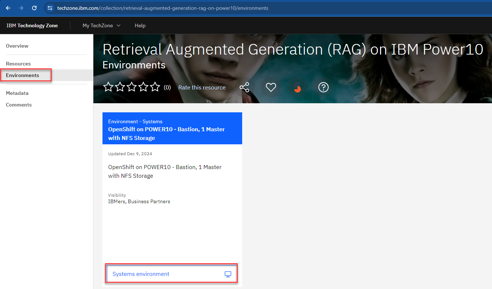
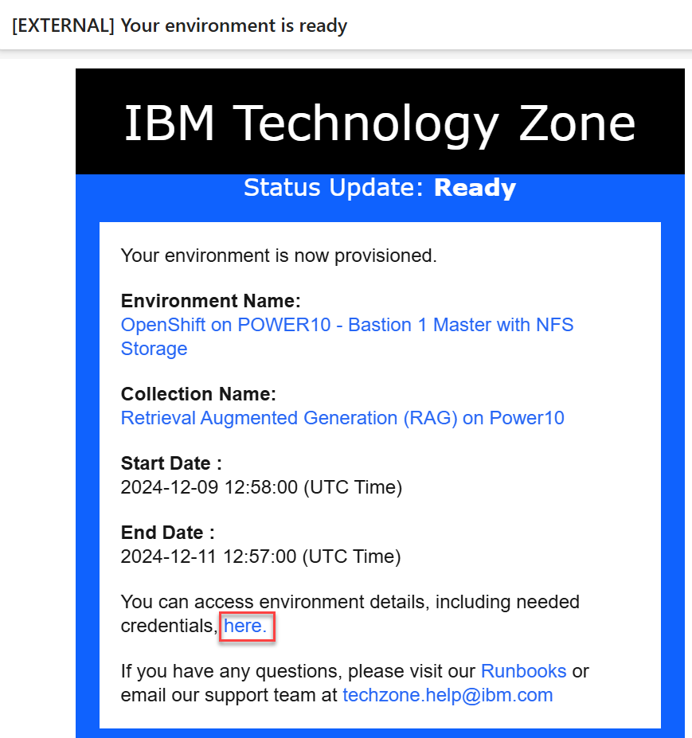
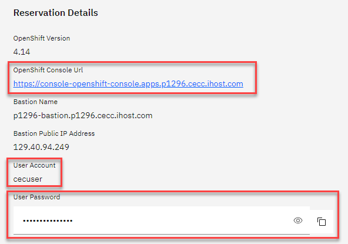
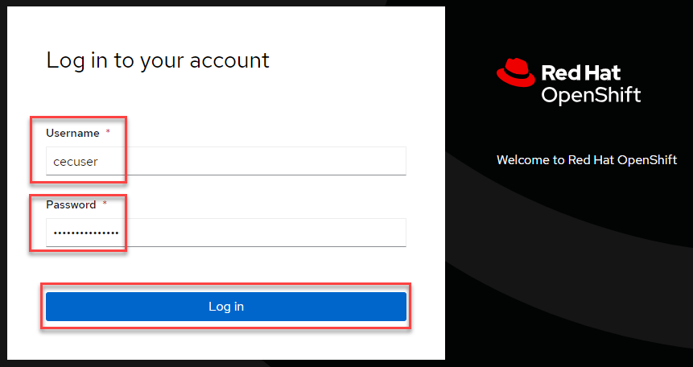
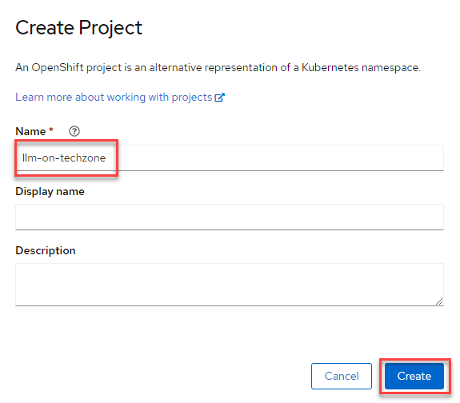
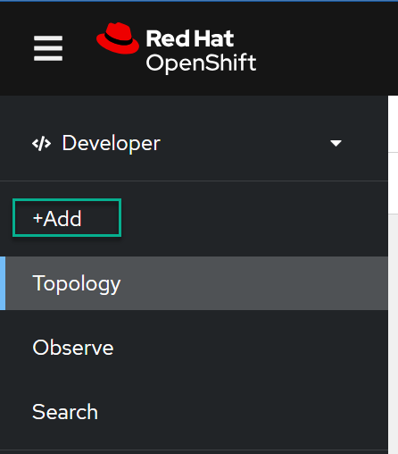
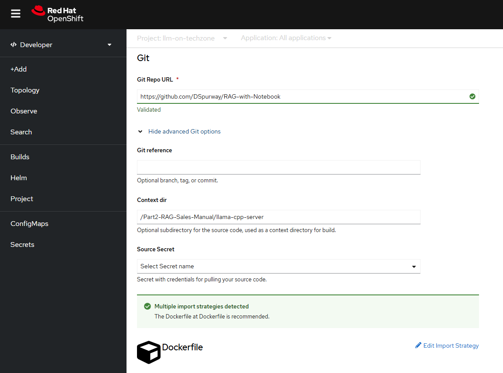
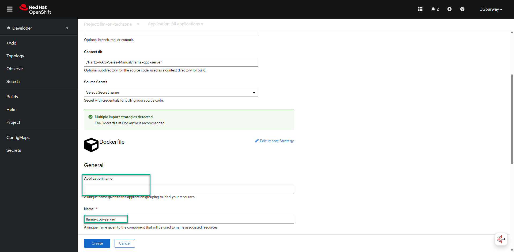
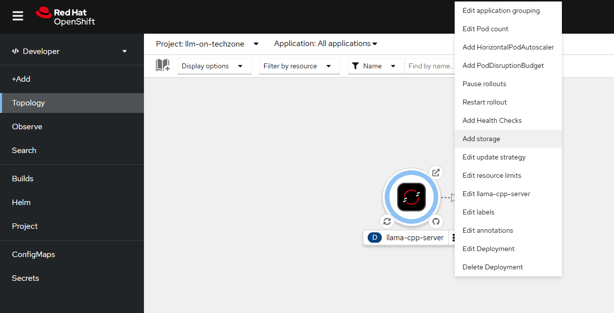

# Hands-on Lab: Deploy a Large Language Model on Power10

In this lab you'll use a pretrained Large Language Model and deploy it on OpenShift. It will make use of the unique Power10 features such as the Vector Scalar Extension (VSX) as well as the newly introduced Matrix-Multiply Assist (MMA) units (also often called Matrix Math Accelerator, but I think the former is the correct techical name!). 

The first part of the lab will focus on the following steps:
- Create a persistent volume to store the model
- Create a deployment using an existing container image that will load the model, serve it and make it accessible via the browser
- Create a service for internal communication
- Create a route for external communication

The second part of the lab will focus on these topics:
- Deploy a vector database, specifically milvus
- Index the database with a sample PDF
- Query the database using pymilvus
- Create a prompt based on the previous answer and pass to the LLM

## 0 Setup
Unlike the original, I am changing this to work with the "Retrieval Augmented Generation (RAG) on Power10" environment which IBMers and IBM Business Partners can reserve from Techzone. This is based on the "OpenShift on POWER10 - Bastion, 1 Master with NFS Storage", which is what I originally used, and the instructions should work on either environment. 

Only IBMers and IBM Business Partners can access Techzone, so the link won't work for anyone else. For IBMers and BPs, access the collection on Techzone here: [https://techzone.ibm.com/collection/retrieval-augmented-generation-rag-on-power10](https://techzone.ibm.com/collection/retrieval-augmented-generation-rag-on-power10)

You will need to reserve the environment, and wait for the deployment to complete and the environment to be ready.



When the environment has been provisioned and is ready, click the "here" link to access the details you will need:



Behind that link, you will have a page headed like this:


Lower in that page you can see the Reservation Details, with the link to the OCP Console, your user name of "cecuser" and the obscured password. Copy the password with the provided button, and click the link to access the OCP console:



Click "htpasswd" to log into the OCP console:


Log in with the user of "cecuser" and the password you copied earlier:



## Part 1: Deploy Large Language Model

Now you're going to create several resources using the WebUI.

### Option A: Using the OpenShift web console

### 1.0 Project

You will need to create a Project to hold our resources, so, from the Developer view, you should find yourself prompted to either select a project or create one. Click on "create a project" to make a new project to hold our work.


Name your project "llm-on-techzone" and click "Create". The name of the project is used in the name resolution for the links we will use later, so if you use a different name, you will need to change the URL names used in the code to match.



### 1.1 Snapshot / PVC

In the **Administrator** view go to:

**Storage** -> **PersistentVolumeClaims** 

and create a Persistent Volume Claim with -> **Create PersistentVolumeClaim**


Go to the YAML view (**Edit YAML** link) and replace the default with


```yaml
apiVersion: v1
kind: PersistentVolumeClaim
metadata:
  name: llama-models
spec:
  accessModes:
    - ReadWriteOnce
  resources:
    requests:
      storage: 10Gi
```

Click Create! What you are doing there is reserving disk space to hold the Large Language Model you will later download from Hugging Face. Note that, while Large Language Models take a lot of resources to train, and also can need a fair amount of processing power and memory to run (depending on factors like the size of the prompt passed to it and more), you don't need a lot of storage space to hold your models. For the model we plan to us, you can see the range of sizes available on HUgging Face here: [https://huggingface.co/TheBloke/TinyLlama-1.1B-Chat-v1.0-GGUF/tree/main](https://huggingface.co/TheBloke/TinyLlama-1.1B-Chat-v1.0-GGUF/tree/main). Why are the all sorts of options there? That is because different forms of Quantization are used for each version of the model listed there. Quantization is a technique to reduce the computational and memory costs of running inference, which also reduces the size of the model, trading off the accuracy of the model against the resources needed to run it. More on Quantization here: [https://www.ibm.com/think/topics/quantization](https://www.ibm.com/think/topics/quantization). In our case, as we are using the smaller Large Language Model called TinyLlama, we will be using the top end version of the model, as it is quite small to begin with. If you play around with larger models, such as the Granite models from IBM, picking a version of the model that balances the computational resources needed with the accuracy you need can be helpful. The MMA features of current IBM Power processors (IBM Power10 and later) can work with models that have less than ~13 billion parameters, but many start with smaller models (and consider quantized versions of larger models) to avoid demanding more resources than you need. Also, larger models can take longer to respond, as they work harder to give you better answers. In this demo, you don't need a lot of accuracy to get answers that are good enough, hence doing for a smaller model.

### 1.2 Deployment

In the "Developer" view, we can use the "+Add" button to add a deployment of the server for our basic large language model:



The page you then get will have a box titled "Git Repository" and you can click on that box to "Import from Git":


You can import from David Spurway's repo by putting in the following URL into the Git Repo URL box, but don't hit "create" yet, as we have more to do!
```
https://github.com/DSpurway/RAG-with-Notebook
```
Now click the "Show advanced Git options" (don't worry, not very advanced!):


Next, add in the Context directory, where there is a Dockerfile it will pick up:
```
/Part2-RAG-Sales-Manual/llama-cpp-server
```


We don't need this in an "application", so delete the "Application Name", and change the Name for the component we are adding to:
```
llama-cpp-server
```


Now, click "Create" at the bottom of that screen!

This will take a couple of minutes, as we need to use the Python ecosystem to gather and install torch and openblas before compiling the llama.cpp server (the "cpp" stands for C Plus Plus, or C++, as it needs compiled in C++!), download the TinyLlama model from Huggingface in GGUF format, and then start up the server to serve up that model. 

While the build is going, we can add the storage it will need, which we made earlier, but could not attach at the time. Use the three dots until the container that is building to give a list of options, and select "Add Storage"




If you now go to the developer view and watch the Topology you can see the llama-cpp server represented as a circle with a dark blue ring if everything deployed correctly:

Light blue ring: (not yet ready)

 

Dark blue ring: (ready)


### 1.5 Access your model

You can access the model by clicking on the little Arrow button in the upper right corner of the circle.

This should open a new browser where you can experiment with the deployed Large Language Model!

First don't change any of the parameters and just **scroll down to to input field "Say something..."** where you can interact with the LLM.


You can ask any question you like, but keep in mind you're using a small model and there are more powerful models out there for general conversation.

What I often do is ask some general question, maybe about the city I am presenting in at the time. A basic question like that usually results in a fairly accurate and acceptable generated response. What I then do is follow up with the question "What is Mr Dursley's job?". The LLM then usually hallucinates, making up some answer that links the city in the previous question with some fabricated Mr Dursley. That is a useful response, as it illustrates the well known problem with GenAI, and you can read more about hallucinations here: [https://www.ibm.com/think/topics/ai-hallucinations](https://www.ibm.com/think/topics/ai-hallucinations). 

Feel free to experiment with the model parameters like temperature and predictions.

In the second part you'll see that smaller, resource-efficient models like this can answer questions based on a given context and instructions quite well! That will demonstrate that huge models aren't always required!

In this second part, we can build on the example of how we demonstrated what a hallucination looks like. Using the Retrieval Augmented Generation (RAG) process we shall demonstrate in this second part, we can show how to make hallucinations much less likely, and also how to make the model able to answer questions on topics that the model alone could not answer, without the need to retrain. This can help users trust the solution, as we know where the answers came from and how up to date they are, which can otherwise be an issue that GenAI is subject too.

## Part 2: Enhance with RAG using Milvus & LangChain

In the second part you will create a vector database (Milvus) that you'll be using for indexing a sample PDF file.

### 2.1 Deploy Milvus

Now, for some of the following commands, you will need the "oc", or OpenShift Client. If you don't already have that, you can get it from the OpenShift session you are already using. Thank you to Andrew Laidlaw for this one! Click on the question mark top right in the OpenShift GUI (next to your username) and select Command Line Tools.


You can then download the appropriate version for the device you are using to connect to OpenShift, such as a Windows or Apple Mac. Install that on your device before running the "oc" commands below.

You can stay in the same OpenShift project.

You will need your OpenShift login token which you can get after logging in to the WebUI, **click on your username** -> **Copy login command** -> **Login again with your credentials** -> **Display token**

Open the terminal (command prompt or PowerShell) and login to your cluster using the token you just copied. Check at this stage what project you are then connected with. If it is not the project where we put the "llama-cpp-server" instance earlier, change the project to that with:

```
oc project llm-on-techzone
```

Clone the repository using Github Desktop or use the terminal:

```
git clone https://github.com/mgiessing/bcn-lab-2084
```
```
cd bcn-lab-2084
```

Now you're going to create the milvus deployment. Milvus is a vector database, and you can read more about that here: [https://www.ibm.com/think/topics/milvus](https://www.ibm.com/think/topics/milvus)
Vector databases store and manage datasets in the form of vectors. Vectors are arrays of numbers that represent complex concepts and objects, such as words and images.  

Unstructured data — such as the text we are about to use — makes up a significant portion of enterprise data today, but traditional databases are often ill-suited to organize and manage this data.  

Organizations can feed this data to specialized deep learning embedding models, which output vector representations called “embeddings.” For example, the word “cat” might be represented by the vector [0.2, -0.4, 0.7], while the word “dog” might be represented by [0.6, 0.1, 0.5].

Transforming data into vectors enables organizations to store different kinds of unstructured data in a shared format in one vector database. We are going to load text from Harry Potter into our Milvus vector database, which will then be used to pull back "chunks" of text that have words in the text that are similar to the question we ask.

So, to deploy our instance of milvus, run these commands:

```
cd Part2-RAG/milvus-deployment
```
```
oc create configmap milvus-config --from-file=./config/milvus.yaml
```
```
oc apply -f .
```
```
cd ..
```

Monitor deployment using:
```
oc get pods -w
```

Wait until you see etcd-deployment, milvus-deployment and minio-deployment in the "running" state.

The `-w, --watch` command can be interrupted with Ctrl+C.

### 2.2 Deploy Notebookserver

To interact with Milvus and your Large Language Model you're using a Notebook server. A Jupyter Notebook is an open source web application that allows data scientists to create and share documents that include live code, equations, and other multimedia resources. You can find out more about Jupyter Notebooks here: [https://jupyter-notebook.readthedocs.io/en/latest/](https://jupyter-notebook.readthedocs.io/en/latest/)

We shall deploy our Jupyter Notebook server in another little container with these commands:

```bash
cd nb-deployment
```
```
oc apply -f .
```

Verify the notebook pod is running:

```
oc get pods --selector=app=cpu-notebook -w
```

You can also check on the deployments by returning to the OpenShift GUI, in the Developer view, waiting for the dark blue circle to surround our new "cpu-notebook" deployment. Access it using the arrow icon on the top right of the container.

When you open the notebook server, drag & drop the notebook (`RAG.ipynb`) from this repo into the notebook server. The "RAG.ipynb" file is back in the starting directory for the cloned repo you now have on your laptop, so you can get back to that by dropping back two layers in your cloned repo:

```
cd ..
```
```
cd ..
```
Or, it is also on this page you are reading here, so download it by clicking on it at the top of the page, and drag and drop either version into the Notebook in your browser. Then, double click on the "RAG.ipynb" file you can now see in the Notebook to open in. Use the "run" arrow on each stage of the code, and let each section execute. You can tell when it is finished running as the "[*]" that appears next to the code as it runs will change into a number within the square brackets. If you click "run" too quickly, that is not a problem, as each section of code will need to finish before it moves on to the next. So you may just have a couple of sections waiting in "[*]", and you can just let them finish in turn.

Follow the steps inside the notebook!

Once done, you should be able to say what the job of the character in Happy Potter who's name was Mr Dursley's job actually was!

You may then want to return to the browser session you had with the Lllama.cpp server at the end of Part 1. Here, you can reset the session with the LLM, and maybe paste in the whole prompt you ended up with at the end of Part 2, and the model should give you the same answer. Then, reset your session again, and repeat the earlier simple questions about a city, followed by "What was Mr Dursley's job?" without the advanced prompt this time. What you should show there is that the model has not actually learned anything, and you go back to hallucinating. That is useful, as a common assumption is that the GenAI models continue to learn, and that data you put into them can be used by these models to learn. But, these LLMs stop learning when the training phase is done, and so they don't learn from the data you pass to them. But, with a "fancy prompt", they can give you usefil and helpful answers. So, your data can remain safely inside your organisation, and hopefully inside IBM Power, and you don't need to go to the expense and effort of training, or retraining, a Large Language Model to get it to give you useful answers from your data. Instead, use RAG on IBM Power, and keep control!

## Conclusion

Congratulations, you've successfully finished the lab `Deploy a Large Language Model on Power10` and learned how to use that as a standalone solution as well as combining it with more complex technologies such as Retrieval Augmented Generation (RAG).

I have updated these instructions based on feedback from some of the helpful people who have tried this out, so, if you have feedback too, do let me know, and I can keep improving this!
